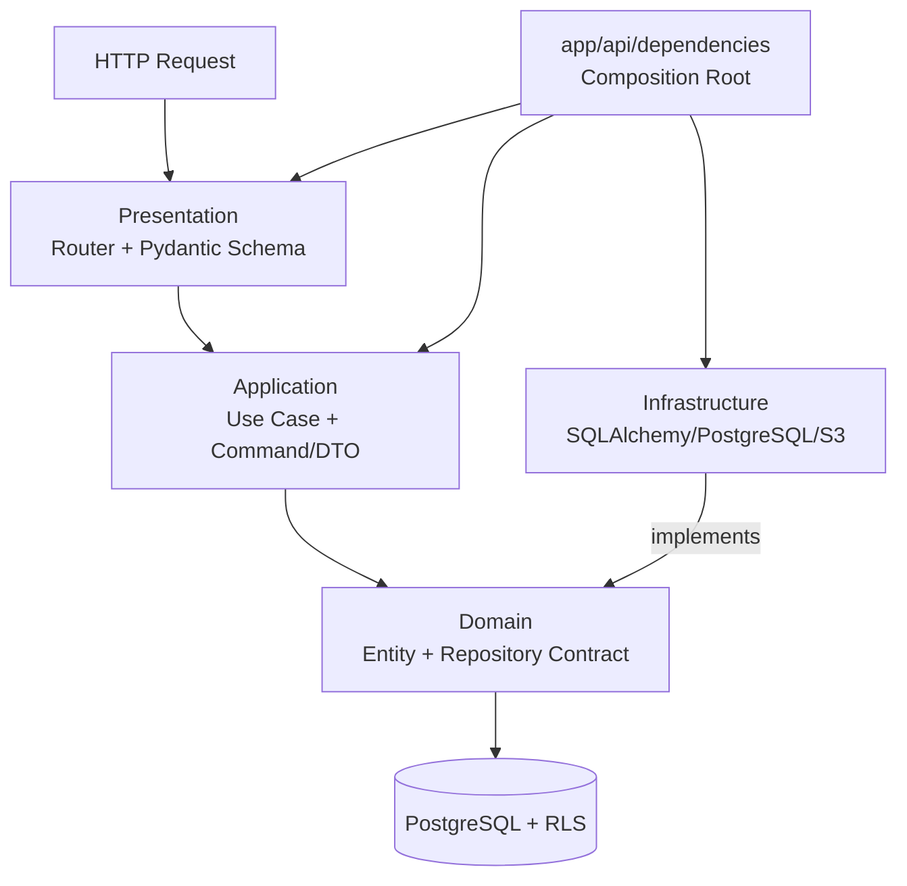
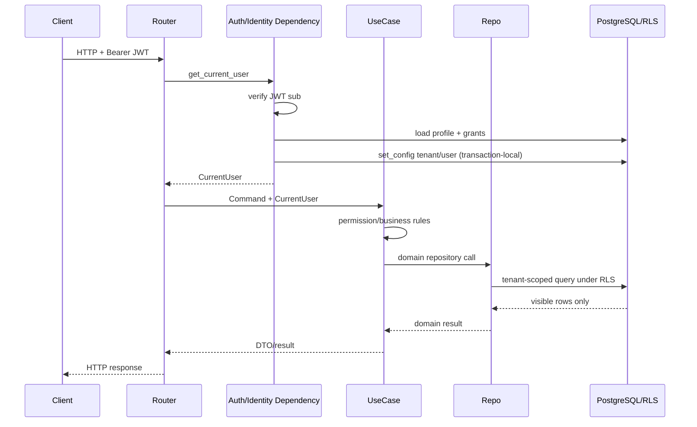

# SCM Demo Backend

本專案是以 FastAPI、SQLAlchemy 2.x、PostgreSQL 與 Alembic 建構的多租戶 SCM／ERP
後端。現有 business modules 包含 Customer、Supplier、Product、Customer Purchase Order、
EDI Message Tracking、Attachment、Dashboard、IAM、Authentication 與 Audit。

本文件是 backend architecture、security boundary、module development standard 與本機開發的
主要工程指南。文件描述的是 repository **目前實際存在**的設計；未完成的方向會明確標示為
planned，而不是當成已實作功能。

## 1. Project Overview

系統採分層、模組化架構。Customer module 是新增 master-data business module 時的 Golden
Reference；Supplier 與 Product 已沿用相近模式。核心原則是：

- HTTP、business orchestration、domain model 與 persistence mechanics 分離。
- Authentication 證明 identity；IAM 解出 permission 與 data scope。
- Application permission check 提供明確行為，PostgreSQL RLS 仍是 authoritative data boundary。
- Tenant 不由任意 request payload 決定。
- Mutable business data 使用 Optimistic Lock，正常刪除優先採 Soft Delete。
- FastAPI runtime 使用受限 DB role，不使用 table owner 或 `BYPASSRLS`。

## 2. Tech Stack

| 項目 | 實作 |
|---|---|
| Runtime | Python 3.12+ |
| API | FastAPI、Uvicorn、Pydantic Settings |
| Persistence | SQLAlchemy 2.x async、asyncpg、PostgreSQL |
| Schema migration | Alembic |
| Authentication | JWT（PyJWT）或明確的 local `dev_header` mode |
| Password hashing | Argon2 |
| Attachment storage | Private AWS S3、presigned URL |
| Testing | pytest、pytest-asyncio、HTTPX |
| Quality | Ruff、mypy strict mode |

實際版本範圍與 tool configuration 以 [`pyproject.toml`](pyproject.toml) 為準。

## 3. Architecture Overview



Conceptual dependency direction：

```text
Presentation
    ↓
Application
    ↓
Domain

Infrastructure ─────→ Domain contracts
```

`app/api/dependencies/` 是 Composition Root：它可以同時知道 application interface 與 concrete
infrastructure，負責組裝 dependency。Business layer 不應反向依賴 FastAPI router。

### Domain

位置：`app/modules/<module>/domain/`

責任：

- Business entities、business value normalization／validation。
- Search criteria、access facts、repository `Protocol`／contract。
- Persistence-framework-independent business vocabulary。

限制：

- 不 import FastAPI、Pydantic HTTP schema 或 SQLAlchemy。
- 不讀取 HTTP request，不執行 SQL。
- 不把 ORM model 當 domain entity。

例子：

- `app/modules/customers/domain/entities.py` 的 `Customer`、`CustomerAddress`。
- `app/modules/customers/domain/repository.py` 的 `CustomerRepository`。

### Application

位置：`app/modules/<module>/application/`

責任：

- Use case orchestration。
- Permission checks、domain rules、transaction intent、audit/event coordination。
- 將 command 轉為 domain operation，產生 DTO／application result。
- 依賴 domain repository contract，而非在 use case 內撰寫 SQL query。

限制：

- 不包含 FastAPI route、`Depends` 或 HTTP response construction。
- 不包含 SQLAlchemy query implementation。
- 不從 request 接受可信的 tenant、role 或 effective permission。

`CustomerUseCases` 是目前 master-data use case 的主要參考。

### Infrastructure

位置：`app/modules/<module>/infrastructure/`

責任：

- SQLAlchemy models 與 mappings。
- Concrete repository、PostgreSQL-specific query 與 persistence mechanics。
- S3 等 external infrastructure adapter。
- 實作 domain repository contracts。

目前 `SqlAlchemyCustomerRepository` 使用 SQLAlchemy ORM/Core query；repository 中**沒有** Customer
PostgreSQL RPC 呼叫。若未來導入既有 RPC，adapter 仍應留在 Infrastructure，並維持相同 domain
contract。

### Presentation

位置：`app/modules/<module>/presentation/`

責任：

- FastAPI `APIRouter`。
- Pydantic request／response schemas。
- Query/header/path parsing 與 HTTP status／response mapping。
- 將 HTTP input 轉為 application command，再呼叫 use case。

限制：

- 不直接寫 SQL。
- 不直接操作 SQLAlchemy model。
- 不成為 permission、validation 或 business-rule layer。

### API dependency / composition layer

位置：`app/api/dependencies/`

典型 wiring：

```text
FastAPI Router
    ↓
get_customer_use_cases()
    ↓
CustomerUseCases(CustomerRepository, AuditWriter, UnitOfWork)
    ↑
SqlAlchemyCustomerRepository(session)
```

共用 request session 由 `app/infrastructure/database/session.py` 提供。Router registration 集中在
`app/api/v1/router.py`。

## 4. Directory Structure

```text
app/
├── main.py                         # App startup、middleware、root router
├── api/
│   ├── dependencies/               # Composition Root / dependency providers
│   └── v1/router.py                # Module router registration
├── core/                           # Config、logging、exceptions、error handlers
├── infrastructure/database/        # Async session、Base、UnitOfWork
├── shared/
│   ├── application/                # Shared application contracts/helpers
│   └── domain/                     # CurrentUser、permission scope/effect
└── modules/
    └── <module>/
        ├── domain/
        ├── application/
        ├── infrastructure/
        └── presentation/

alembic/versions/                    # Versioned schema / permission / seed migrations
scripts/                             # Explicit local/demo utilities
sql/                                 # Local PostgreSQL role setup notes
tests/unit/                          # Current automated test suite
```

## 5. Dependency Rules

允許：

- Presentation → Application／Domain types。
- Application → Domain contracts、shared application/domain abstractions。
- Infrastructure → Domain contracts/entities。
- Composition Root → Application + Infrastructure concrete implementations。

避免：

- Domain → FastAPI／SQLAlchemy／Pydantic HTTP schema。
- Application use case → concrete SQLAlchemy repository。
- Router → ORM model 或 database session query。
- Repository → UI capability decisions。
- 任意 business module 直接複製 IAM resolution 或 RLS setup。

跨 module orchestration 有時是必要的，例如 inbound EDI 使用既有 `CustomerPoUseCases.create()`；應維持
明確 application boundary，避免跨 module 直接存取對方 ORM table。

## 6. Request Lifecycle

一般 ERP request：



`LoggingMiddleware` 建立 request/correlation context；central error handler 產生一致 error envelope。

## 7. Authentication / Authorization / RLS

### ERP interactive identity

實際流程：

```text
Bearer JWT
→ JwtService verifies signature/issuer/audience/expiry
→ trusted user id from sub
→ CurrentUserService loads DB profile/status
→ EffectivePermissionResolver loads and merges grants
→ load_current_user_context binds log context
→ transaction-local app.tenant_id / app.user_id
→ CurrentUser
→ use-case permission check
→ repository query under PostgreSQL RLS
```

參考：

- `app/api/dependencies/auth.py`
- `app/api/dependencies/identity.py`
- `app/modules/iam/application/current_user_service.py`
- `app/modules/iam/application/permission_resolver.py`
- `app/shared/domain/current_user.py`

`AuthenticatedPrincipal` 只證明「誰在呼叫」；tenant、active status、role、group、policy 與 effective
permissions 由 DB 載入。不得信任 frontend 自報的 tenant／role／permission。

Permission 使用 `resource.action` code，並帶 `ALLOW`／`DENY` 與 `NONE`、`OWN`、`ASSIGNED`、
`TEAM`、`ALL` scope。Application check 用來提供明確 403／capability；RLS 仍是最後 data-scope
boundary。被 scope/RLS 隱藏的 entity 通常回 404，以免洩漏存在性。

### Local authentication modes

- `AUTH_MODE=jwt`：只接受 Bearer JWT，不 fallback 到 dev header。
- `AUTH_MODE=dev_header`：local development 可使用 `X-Dev-User-Id`。
- EDI inbound 使用獨立 `EDI_INBOUND_AUTH_MODE`；`dev_no_auth` 只允許 local/test，仍載入設定的
  existing IAM user 並建立相同 RLS context。`api_key` mode 目前 fail closed，完整 B2B credential
  lifecycle 尚未實作。

### Multi-tenant rules

- Tenant-scoped business data 必須同時遵守 application scope 與 DB RLS。
- Caller-supplied tenant ID 不能成為 trust boundary。
- Repository 不得關閉、弱化或繞過 RLS。
- Admin 代表 permission/scope 設計，不代表可使用 table owner bypass tenant。
- 跨 tenant composite FK／unique/index 應包含 tenant identity（依資料模型適用性）。

## 8. Database Ownership

FastAPI startup **不呼叫** `Base.metadata.create_all()`。`app/main.py` 只設定 logging、middleware、
error handlers 與 router；不在 runtime 自動重建 schema。

目前 repository 的 schema、RLS policy、permission seed 與 demo seed 以 versioned Alembic migrations
管理。SQLAlchemy models 映射 PostgreSQL structures；production baseline 的變更必須透過受審查的
database migration 與既有 Supabase/PostgreSQL deployment 流程，而不是由 app startup 猜測或重建。

DB roles：

- `MIGRATION_DATABASE_URL`：schema owner（local example 為 `scm_owner`），僅供 Alembic。
- `DATABASE_URL`：FastAPI restricted runtime role（local example 為 `app_runtime`）。
- Runtime role 不得擁有 application tables，不得有 `BYPASSRLS`。
- 不得將 production password、JWT secret、AWS credential 或 service-role credential commit。

Local role bootstrap 參考 `sql/README.md`；migration source 位於 `alembic/versions/`。

## 9. Customer Reference Module

Customer 是未來 master-data module 的 Golden Reference：

1. Domain `Customer` 保持 ORM-independent，並負責 code/name normalization。
2. `CustomerRepository` Protocol 描述 search、access facts、CRUD、soft-delete/restore。
3. `CustomerUseCases` 執行 permission、scope、business validation、audit 與 transaction orchestration。
4. `SqlAlchemyCustomerRepository` 將 scope 轉成 SQLAlchemy query，並 mapping Business Partner tables。
5. `get_customer_use_cases()` 注入 repository、AuditWriter 與 UnitOfWork。
6. Router 將 request schema 轉成 command，不直接做 persistence。

Customer 實際建立的是 Business Partner master data：

```text
business_partners
partner_roles (CUSTOMER)
partner_addresses
customer_user_assignments / customer_group_assignments
```

Customer 與 Supplier 可透過 `partner_roles` 成為同一 Business Partner 的多角色，不應再建立第二套
standalone Customer/Supplier master table。

## 10. Soft Delete Standard

Customer 的刪除語意是停用 `CUSTOMER` partner role，而非刪除 shared Business Partner：

- Normal search 隱藏 role `deleted_at` 不為 null 的 Customer。
- `show_deleted=true` 提供明確查詢行為。
- `POST /customers/{id}/soft-delete` 軟刪除。
- `POST /customers/{id}/restore` 還原。
- Delete/restore 同樣檢查 permission、scope 與 `row_version`。

Supplier、Product、Customer PO 等正常 master/business entities 也採 soft-delete/restore pattern。除非
domain 明確要求，不要隨意新增 hard-delete UI/API。Child line replacement、temporary token cleanup 等
technical lifecycle 可依實際 domain 採不同策略。

## 11. Optimistic Lock

Mutable records 使用 `row_version` 與 `expected_version`：

```text
Client reads row_version = N
→ update/delete/restore sends expected_version = N
→ repository UPDATE includes WHERE row_version = N
→ success: row_version = row_version + 1
→ no matching row: VersionConflict → HTTP 409
```

新增 mutable master/business entity 時，若存在 concurrent update 風險，應沿用此 pattern。禁止在
版本不符時靜默覆寫較新的 DB state。

## 12. Error Handling

Project exceptions 定義於 `app/core/exceptions.py`，包含 authentication、permission、not found、
version conflict、entity conflict、validation 與 external service errors。

`app/core/error_handlers.py` 將 `AppError` 統一映射為：

```json
{
  "error": {
    "code": "VALIDATION_ERROR",
    "message": "...",
    "details": {},
    "correlationId": "...",
    "requestId": "..."
  }
}
```

Domain/application code 應 raise meaningful project exception；不要在深層 use case/repository 建構
`JSONResponse` 或任意 FastAPI exception。HTTP mapping 留在 centralized handler/presentation boundary。

## 13. Module Development Standard

建議結構（只建立實際需要的檔案，不為空功能過度 scaffold）：

```text
app/modules/<module>/
├── domain/
│   ├── entities.py
│   └── repository.py
├── application/
│   ├── commands.py
│   ├── dto.py
│   └── use_cases.py
├── infrastructure/
│   ├── models.py
│   └── repository.py
└── presentation/
    ├── schemas.py
    └── router.py

app/api/dependencies/<module>.py
```

Development flow：

```text
Database table/index/FK/RLS/permissions migration
→ Domain entity + repository contract
→ Application command/DTO/use case
→ Infrastructure model/repository
→ Dependency wiring
→ Presentation schema/router
→ app/api/v1/router.py registration
→ Unit tests + DB/RLS integration tests
→ Frontend integration
```

每一層的 review 問題：

- Business invariant 是否在 Domain/Application，而非 router？
- Application 是否只依賴 repository contract？
- SQLAlchemy/Postgres code 是否只在 Infrastructure/migration？
- Tenant、permission、scope、RLS 是否都被保留？
- Mutation 是否需要 audit、event、transaction、optimistic lock、soft delete？
- Pydantic schema 是否只是 transport contract？

Supplier、Product、Purchase Order、Sales Order 等新 module 優先複製 Customer 的 architectural shape，
除非有明確 architecture decision 說明差異。

## 14. EDI Development Direction

目前已實作 protocol-neutral ERP-side EDI message tracking：`edi_messages`、append-only
`edi_message_events`、inbound REST 850 → Customer PO processing、technical duplicate detection、message
search/detail/events 與 Customer PO EDI history。

SCM ERP 只擁有 ERP processing status、business entity linkage 與 external B2B message ID；raw EDI file、
S3 transport object、AS2 MDN/certificate、SFTP path 與 transport retry 屬外部 B2B platform，不應複製到
本 repository。

未來功能應保持可分離：

```text
Transport / inbound（planned outside or adapter boundary）
Parser（planned）
Validation
Mapping
Business import
Acknowledgement（planned）
Operational tracking
```

不要把 parser、AS2/SFTP、mapping、business import、UI query 全塞進單一 giant router/service。
Outbound model 已預留 direction/event vocabulary，但 outbound sending 尚未實作。

## 15. Testing & Quality Gate

安裝 dev dependencies 後，repository 支援：

```bash
.venv/bin/pytest -q
.venv/bin/ruff check app tests alembic
.venv/bin/mypy app
git diff --check
```

也可在已啟用 virtualenv 後省略 `.venv/bin/`。

新 business module 至少應覆蓋：

- Domain normalization、invariant 與 status transition。
- Use-case success、permission denied、validation、not-found。
- Optimistic-lock 409（適用時）。
- Soft-delete/restore（適用時）。
- Repository mapping/query contract。
- API request/response contract。
- Transaction rollback 與 audit/event consistency（適用時）。

`tests/unit/` 目前主要是 isolated unit/API contract/static migration tests；這不等同使用 restricted
runtime role 驗證真實 PostgreSQL policy。凡 security 依賴 RLS、composite tenant FK 或 transaction-local
`set_config` 時，應另有真 DB integration test，驗證 cross-tenant rows 不可見且不可寫入。

不要因 unit test 中手動傳入 `tenant_id` 就宣稱 RLS 已被測試。

## 16. Environment / Local Startup

### Prerequisites

- Python 3.12+
- PostgreSQL database（example：`scm_local`）
- Schema/migration role（example：`scm_owner`）
- Restricted runtime role（example：`app_runtime`）

### Setup

```bash
python3.12 -m venv .venv
source .venv/bin/activate
pip install -e ".[dev]"
cp .env.example .env
```

請替換 `.env` 中的 local credentials；不要提交 `.env`。Local DB role 建立方式見
`sql/README.md`。

### Migrate and run

```bash
alembic upgrade head
uvicorn app.main:app --reload
```

- Health：`GET http://127.0.0.1:8000/health`
- Swagger：`http://127.0.0.1:8000/docs`

### Local users and passwords

Migration 提供 deterministic demo profiles。不要把 plaintext password 放進 migration/source；使用：

```bash
APP_ENV=local .venv/bin/python scripts/set_dev_password.py jack@local.test
```

JWT mode 的 `JWT_SECRET` 至少 32 bytes。`.env.example` 同時記錄 JWT、logging、S3 與 attachment
configuration keys。

## 17. Adding a New Module

以 `purchase_orders` 為例：

1. 先確認 DB ownership、tenant key、RLS policy、FK、indexes、permission codes。
2. 建立 persistence-independent `PurchaseOrder` entity 與 repository `Protocol`。
3. 建立 commands/search criteria/DTO/use cases；定義 permission、scope、status transition。
4. 在 Infrastructure 實作 SQLAlchemy model/repository；不要讓 model 洩漏到 use case。
5. 在 `app/api/dependencies/purchase_orders.py` 組裝 repository、audit/event、UnitOfWork。
6. 建立 Pydantic schemas 與 thin router。
7. 在 `app/api/v1/router.py` 註冊 router。
8. 測試 permission、tenant、validation、conflict、soft delete、optimistic lock 與 RLS。

如果新功能跨 module，優先呼叫對方 application boundary；不要 raw insert 對方 business table。

## 18. Prohibited Patterns

**DO NOT：**

- 在 FastAPI router 內寫 SQL 或直接操作 ORM model。
- 把 SQLAlchemy model 放進 Domain。
- 在 Domain entity import FastAPI/Pydantic HTTP schema。
- 把 permission/business rule 堆進 router。
- 讓 application use case bypass repository contract 直接 query DB。
- 信任 frontend 傳入的 tenant、role、permission 或 active status。
- bypass/disable PostgreSQL RLS，或加入 ad-hoc tenant bypass。
- 以 table owner、migration role 或 `BYPASSRLS` role 執行 FastAPI。
- 在 production baseline 呼叫 `Base.metadata.create_all()`。
- commit DB password、JWT secret、AWS/service-role credential 或 private key。
- 靜默繞過 `row_version`／Optimistic Lock。
- 對正常 business/master data 隨意加入 hard delete。
- 為每個 module 創造互不相容的第二套 architecture。
- 為了方便測試而在 EDI/application code 自動建立缺少的 Customer。

## 19. Known Gaps / Architectural Debt

以下均是 repository review 可直接確認的現況，本文件不在 documentation task 中修改 production code：

1. **DB/RLS integration test coverage 不完整**：現有 automated suite 集中在 `tests/unit/`；尚未形成
   一套明確、獨立、以 restricted `app_runtime` 驗證 cross-tenant RLS 的 integration test suite。
2. **部分跨 module application coupling**：EDI inbound 直接依賴 concrete `CustomerPoUseCases`；Audit
   diff service 直接知道 Product/Supplier entities；Dashboard domain/application 直接引用 Customer PO
   vocabulary。這些是現有 orchestration，擴張前應評估 boundary contract，而非繼續任意擴散。
3. **Customer application 的 supporting services 並非全為 Protocol**：repository 與 UnitOfWork 有
   contract，但 `AuditWriter`／`AuditDiffService` 以 concrete application classes 注入。測試仍可替換，
   但 dependency inversion 不完全一致。
4. **Customer RPC premise 與程式不符**：Customer infrastructure 目前是 SQLAlchemy ORM/Core，沒有
   repository-owned PostgreSQL RPC adapter。若 production 另有外部 RPC baseline，本 repo 尚未建立
   對應 adapter/contract，也不能由 README 宣稱已整合。
5. **Permission naming 的 repo 內狀態**：backend migration、use case 與 tests 一致使用
   `customers.read`、`customers.detail.read`，搜尋不到 `customers.view`。本 repo 不含 frontend，故無法
   證實或排除 frontend/其他 repo 使用 `customers.view`；跨 repo contract 仍需在 integration 時核對。
6. **Authentication provider scope**：JWT verification、local passwords 與 refresh token 已實作；完整
   external IdP/Supabase Auth provisioning flow 並未由本 repo 展示。EDI `api_key` mode 目前明確
   fail closed，partner credential lifecycle 尚未實作。
7. **Module shape 尚未完全一致**：Customer/Supplier/Product 接近四層架構；Dashboard 與部分 support
   modules 採較精簡結構。新增 business module 應以 Customer 為準，不應把現有例外當新標準。

## 20. Definition of Done

一個 substantial backend change 在 push 前應確認：

- 需求與 system ownership boundary 已確認，沒有實作到錯誤系統。
- Layer placement 與 dependency direction 符合本文件。
- Permission code、scope、tenant/RLS、not-found leakage behavior 已確認。
- Migration 包含必要 FK/index/constraint/RLS/grant，且不改寫 applied migration。
- Mutation 的 transaction、audit/event、soft delete、optimistic lock 已按 domain 處理。
- Request/response schema 與 error contract 已測試。
- Unit tests 與必要的 DB/RLS integration tests 已通過。
- `pytest`、`ruff`、`mypy`（適用範圍）與 `git diff --check` 通過。
- README/API contract 在 architecture 或 setup 改變時同步更新。
- Git staging 只包含本次 task，沒有混入 unrelated user changes 或 secrets。
