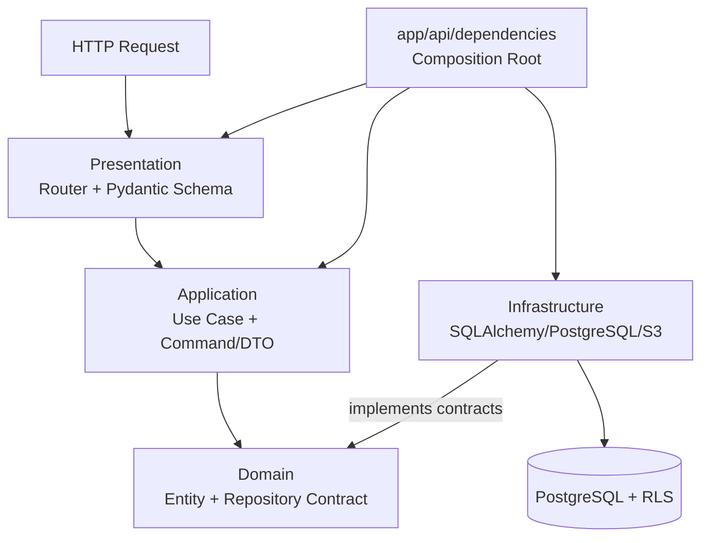
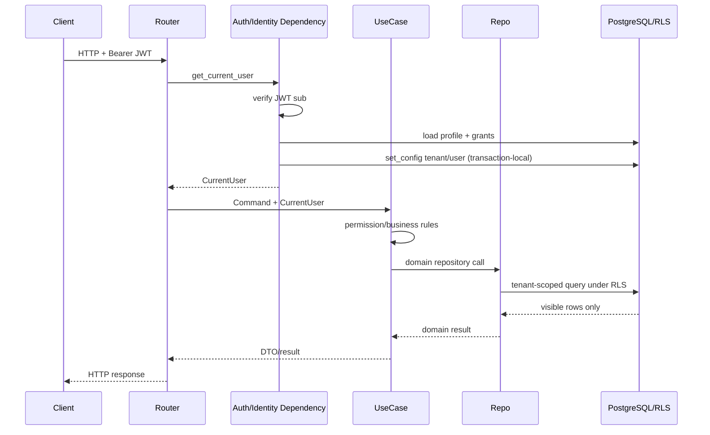

# SCM Demo Backend

This project is a multi-tenant SCM/ERP backend built with FastAPI, SQLAlchemy 2.x, PostgreSQL, and Alembic. The current business modules include Customer, Supplier, Product, Customer Purchase Order, EDI Message Tracking, Attachment, Dashboard, IAM, Authentication, and Audit.

This document is the primary engineering guide for backend architecture, security boundaries, module development standards, and local development. It describes the design that currently exists in the repository. Incomplete directions are explicitly marked as planned rather than presented as implemented functionality.

## 1. Project Overview

The system uses a layered, modular architecture. The Customer module is the Golden Reference for new master-data business modules, and Supplier and Product follow a similar pattern.

Core principles:

- Keep HTTP, business orchestration, domain models, and persistence mechanics separate.
- Authentication proves identity; IAM resolves permissions and data scope.
- Application-level permission checks provide explicit behavior, while PostgreSQL RLS remains the authoritative data boundary.
- Tenant identity must not be trusted from arbitrary request payloads.
- Mutable business data uses Optimistic Locking, and normal deletion should prefer Soft Delete.
- The FastAPI runtime uses a restricted database role rather than the table owner or a role with `BYPASSRLS`.

## 2. Tech Stack

| Area | Implementation |
|---|---|
| Runtime | Python 3.12+ |
| API | FastAPI, Uvicorn, Pydantic Settings |
| Persistence | SQLAlchemy 2.x async, asyncpg, PostgreSQL |
| Schema migration | Alembic |
| Authentication | JWT with PyJWT or explicit local `dev_header` mode |
| Password hashing | Argon2 |
| Attachment storage | Private AWS S3, presigned URLs |
| Testing | pytest, pytest-asyncio, HTTPX |
| Quality | Ruff, mypy strict mode |

See [`pyproject.toml`](pyproject.toml) for the actual supported version ranges and tooling configuration.

## 3. Architecture Overview



Conceptual dependency direction:

```text
Presentation
    ↓
Application
    ↓
Domain

Infrastructure ─────→ Domain contracts
```

`app/api/dependencies/` is the Composition Root. It may know both application interfaces and concrete infrastructure implementations and is responsible for dependency wiring. Business layers must not depend back on FastAPI routers.

### Domain

Location: `app/modules/<module>/domain/`

Responsibilities:

- Business entities and business value normalization/validation.
- Search criteria, access facts, repository `Protocol` contracts.
- Persistence-framework-independent business vocabulary.

Constraints:

- Do not import FastAPI, Pydantic HTTP schemas, or SQLAlchemy.
- Do not read HTTP requests or execute SQL.
- Do not treat ORM models as domain entities.

Examples:

- `Customer` and `CustomerAddress` in `app/modules/customers/domain/entities.py`.
- `CustomerRepository` in `app/modules/customers/domain/repository.py`.

### Application

Location: `app/modules/<module>/application/`

Responsibilities:

- Use-case orchestration.
- Permission checks, domain rules, transaction intent, and audit/event coordination.
- Convert commands into domain operations and produce DTO/application results.
- Depend on domain repository contracts rather than writing SQL inside use cases.

Constraints:

- Do not include FastAPI routes, `Depends`, or HTTP response construction.
- Do not include SQLAlchemy query implementation.
- Do not trust tenant, role, or effective permissions supplied directly by the request.

`CustomerUseCases` is the current primary reference for master-data use cases.

### Infrastructure

Location: `app/modules/<module>/infrastructure/`

Responsibilities:

- SQLAlchemy models and mappings.
- Concrete repositories, PostgreSQL-specific queries, and persistence mechanics.
- External infrastructure adapters such as S3.
- Implement domain repository contracts.

`SqlAlchemyCustomerRepository` currently uses SQLAlchemy ORM/Core queries. There are no Customer-specific PostgreSQL RPC calls in the repository. If an existing RPC is introduced later, the adapter should remain in Infrastructure while preserving the same domain contract.

### Presentation

Location: `app/modules/<module>/presentation/`

Responsibilities:

- FastAPI `APIRouter` definitions.
- Pydantic request/response schemas.
- Query/header/path parsing and HTTP status/response mapping.
- Convert HTTP input into application commands before calling use cases.

Constraints:

- Do not write SQL directly.
- Do not manipulate SQLAlchemy models directly.
- Do not become the permission, validation, or business-rule layer.

### API Dependency / Composition Layer

Location: `app/api/dependencies/`

Typical wiring:

```text
FastAPI Router
    ↓
get_customer_use_cases()
    ↓
CustomerUseCases(CustomerRepository, AuditWriter, UnitOfWork)
    ↑
SqlAlchemyCustomerRepository(session)
```

The shared request session is provided by `app/infrastructure/database/session.py`. Router registration is centralized in `app/api/v1/router.py`.

## 4. Directory Structure

```text
app/
├── main.py                         # App startup, middleware, root router
├── api/
│   ├── dependencies/               # Composition Root / dependency providers
│   └── v1/router.py                # Module router registration
├── core/                           # Config, logging, exceptions, error handlers
├── infrastructure/database/        # Async session, Base, UnitOfWork
├── shared/
│   ├── application/                # Shared application contracts/helpers
│   └── domain/                     # CurrentUser, permission scope/effect
└── modules/
    └── <module>/
        ├── domain/
        ├── application/
        ├── infrastructure/
        └── presentation/

alembic/versions/                    # Versioned schema / permission / seed migrations
scripts/                             # Explicit local/demo utilities
sql/                                 # Local PostgreSQL role setup notes
tests/unit/                          # Current automated test suite
```

## 5. Dependency Rules

Allowed:

- Presentation → Application / Domain types.
- Application → Domain contracts and shared application/domain abstractions.
- Infrastructure → Domain contracts/entities.
- Composition Root → Application + Infrastructure concrete implementations.

Avoid:

- Domain → FastAPI / SQLAlchemy / Pydantic HTTP schemas.
- Application use cases → concrete SQLAlchemy repositories.
- Router → ORM model or database session query.
- Repository → UI capability decisions.
- Business modules duplicating IAM resolution or RLS setup.

Cross-module orchestration is sometimes necessary. For example, inbound EDI calls the existing `CustomerPoUseCases.create()` boundary. Keep a clear application boundary and avoid accessing another module's ORM tables directly.

## 6. Request Lifecycle

Typical ERP request:



`LoggingMiddleware` creates the request/correlation context, and the centralized error handler produces a consistent error envelope.

## 7. Authentication / Authorization / RLS

### ERP Interactive Identity

Actual flow:

```text
Bearer JWT
→ JwtService verifies signature/issuer/audience/expiry
→ trusted user id from sub
→ CurrentUserService loads DB profile/status
→ EffectivePermissionResolver loads and merges grants
→ load_current_user_context binds log context
→ transaction-local app.tenant_id / app.user_id
→ CurrentUser
→ use-case permission check
→ repository query under PostgreSQL RLS
```

References:

- `app/api/dependencies/auth.py`
- `app/api/dependencies/identity.py`
- `app/modules/iam/application/current_user_service.py`
- `app/modules/iam/application/permission_resolver.py`
- `app/shared/domain/current_user.py`

`AuthenticatedPrincipal` only proves who is calling. Tenant, active status, role, group, policy, and effective permissions are loaded from the database. Never trust tenant, role, or permission values reported by the frontend.

Permissions use `resource.action` codes with `ALLOW` / `DENY` effects and `NONE`, `OWN`, `ASSIGNED`, `TEAM`, and `ALL` scopes. Application checks provide explicit 403/capability behavior; RLS remains the final data-scope boundary. Entities hidden by scope or RLS normally return 404 to avoid existence disclosure.

Canonical permission families currently used by backend code are listed below. Before adding a new permission check, verify migrations, use cases, and tests rather than inventing a near-synonym.

| Resource | Canonical permissions |
|---|---|
| Customer | `customers.read`, `customers.detail.read`, `customers.create`, `customers.update`, `customers.delete`, `customers.restore`, `customers.assign_owner`, `customers.export` |
| Supplier | `suppliers.read`, `suppliers.detail.read`, `suppliers.create`, `suppliers.update`, `suppliers.delete`, `suppliers.restore`, `suppliers.assign_owner`, `suppliers.export` |
| Product | `products.read`, `products.detail.read`, `products.create`, `products.update`, `products.delete`, `products.restore`, `products.assign_owner`, `products.export` |
| Customer PO | `customer_pos.read`, `customer_pos.detail.read`, `customer_pos.create`, `customer_pos.update`, `customer_pos.delete`, `customer_pos.restore`, `customer_pos.change_status`, `customer_pos.assign_owner`, `customer_pos.export` |
| Dashboard / Audit / EDI tracking | `dashboard.customer_pos.read`, `audit.read`, `edi_messages.read`, `edi_messages.detail.read` |
| IAM read APIs | `users.read`, `groups.read`, `roles.read`, `policies.read`, `permissions.read` |

### Local Authentication Modes

- `AUTH_MODE=jwt`: accepts Bearer JWT only and does not fall back to the dev header.
- `AUTH_MODE=dev_header`: local development may use `X-Dev-User-Id`.
- EDI inbound uses a separate `EDI_INBOUND_AUTH_MODE`. `dev_no_auth` is allowed only for local/test environments; it still loads the configured existing IAM user and establishes the same RLS context. `api_key` mode currently fails closed because the full B2B credential lifecycle is not implemented yet.

### Multi-Tenant Rules

- Tenant-scoped business data must obey both application scope and database RLS.
- Caller-supplied tenant IDs must not become a trust boundary.
- Repositories must not disable, weaken, or bypass RLS.
- Admin means permission/scope design, not permission to use the table owner to bypass tenant isolation.
- Cross-tenant composite FKs, unique constraints, and indexes should include tenant identity where appropriate to the data model.

## 8. Database Ownership

FastAPI startup does **not** call `Base.metadata.create_all()`. `app/main.py` only configures logging, middleware, error handlers, and routers; it does not recreate schema at runtime.

The repository manages schema, RLS policies, permission seeds, and demo seeds through versioned Alembic migrations. SQLAlchemy models map PostgreSQL structures. Production baseline changes must go through reviewed database migrations and the existing Supabase/PostgreSQL deployment process rather than being inferred or rebuilt by application startup.

Database roles:

- `MIGRATION_DATABASE_URL`: schema owner, for example `scm_owner`, used only by Alembic.
- `DATABASE_URL`: restricted FastAPI runtime role, for example `app_runtime`.
- The runtime role must not own application tables and must not have `BYPASSRLS`.
- Never commit production passwords, JWT secrets, AWS credentials, service-role credentials, or private keys.

See `sql/README.md` for local role bootstrap instructions. Migration sources live in `alembic/versions/`.

## 9. Customer Reference Module

Customer is the Golden Reference for future master-data modules:

1. The domain `Customer` remains ORM-independent and owns code/name normalization.
2. `CustomerRepository` defines search, access facts, CRUD, soft-delete, and restore behavior.
3. `CustomerUseCases` performs permission checks, scope checks, business validation, audit handling, and transaction orchestration.
4. `SqlAlchemyCustomerRepository` converts scope into SQLAlchemy queries and maps Business Partner tables.
5. `get_customer_use_cases()` injects the repository, `AuditWriter`, and `UnitOfWork`.
6. The router converts request schemas into commands and does not perform persistence directly.

Customer records are implemented as Business Partner master data:

```text
business_partners
partner_roles (CUSTOMER)
partner_addresses
customer_user_assignments / customer_group_assignments
```

Customer and Supplier may represent multiple roles on the same Business Partner through `partner_roles`. Do not create a second standalone Customer/Supplier master table for the same party.

## 10. Soft Delete Standard

Customer deletion means deactivating the `CUSTOMER` partner role rather than deleting the shared Business Partner:

- Normal search hides Customers whose role `deleted_at` is not null.
- `show_deleted=true` provides explicit access to deleted records.
- `POST /customers/{id}/soft-delete` performs soft delete.
- `POST /customers/{id}/restore` restores the record.
- Delete/restore operations also check permission, scope, and `row_version`.

Supplier, Product, Customer PO, and similar master/business entities follow the same soft-delete/restore pattern. Do not introduce hard-delete UI/API behavior unless the domain explicitly requires it. Technical lifecycles such as replacing child lines or cleaning up temporary tokens may use different strategies where appropriate.

## 11. Optimistic Lock

Mutable records use `row_version` and `expected_version`:

```text
Client reads row_version = N
→ update/delete/restore sends expected_version = N
→ repository UPDATE includes WHERE row_version = N
→ success: row_version = row_version + 1
→ no matching row: VersionConflict → HTTP 409
```

New mutable master/business entities should follow this pattern when concurrent updates are possible. Never silently overwrite a newer database state when versions do not match.

## 12. Error Handling

Project exceptions are defined in `app/core/exceptions.py` and include authentication, permission, not-found, version-conflict, entity-conflict, validation, and external-service errors.

`app/core/error_handlers.py` maps `AppError` consistently to:

```json
{
  "error": {
    "code": "VALIDATION_ERROR",
    "message": "...",
    "details": {},
    "correlationId": "...",
    "requestId": "..."
  }
}
```

Domain/application code should raise meaningful project exceptions. Do not build `JSONResponse` objects or arbitrary FastAPI exceptions inside deep use cases or repositories. Keep HTTP mapping in the centralized handler/presentation boundary.

## 13. Module Development Standard

Recommended structure. Create only files that are actually needed; do not over-scaffold empty functionality:

```text
app/modules/<module>/
├── domain/
│   ├── entities.py
│   └── repository.py
├── application/
│   ├── commands.py
│   ├── dto.py
│   └── use_cases.py
├── infrastructure/
│   ├── models.py
│   └── repository.py
└── presentation/
    ├── schemas.py
    └── router.py

app/api/dependencies/<module>.py
```

Development flow:

```text
Confirm existing database schema, ownership, and source of truth
→ Create only necessary service-owned migrations for tables/indexes/FKs/RLS/permissions
→ Domain entity + repository contract
→ Application command/DTO/use case
→ Infrastructure model/repository
→ Dependency wiring
→ Presentation schema/router
→ app/api/v1/router.py registration
→ Unit tests + DB/RLS integration tests
→ Frontend integration
```

Layer review questions:

- Are business invariants implemented in Domain/Application rather than routers?
- Does Application depend only on repository contracts?
- Is SQLAlchemy/PostgreSQL code confined to Infrastructure/migrations?
- Are tenant, permission, scope, and RLS rules preserved?
- Do mutations need audit, event, transaction, optimistic lock, or soft-delete handling?
- Are Pydantic schemas used only as transport contracts?

For new Supplier, Product, Purchase Order, Sales Order, and similar modules, prefer the Customer architectural shape unless there is an explicit architecture decision documenting why the module differs.

## 14. EDI Scope Note

The repository currently contains ERP-side EDI message tracking and inbound REST Customer PO processing. This document only records those capabilities as current modules. It does not define new EDI Log, parser, transport, AS2, SFTP, X12, or B2B adapter architecture.

Future EDI work must confirm system ownership and requirements separately rather than expanding scope based on this architecture guide alone.

## 15. Testing & Quality Gate

After installing development dependencies, the repository supports:

```bash
.venv/bin/pytest -q
.venv/bin/ruff check app tests alembic
.venv/bin/mypy app
git diff --check
```

When a virtual environment is already activated, the `.venv/bin/` prefix may be omitted.

A new business module should cover at least:

- Domain normalization, invariants, and status transitions.
- Use-case success, permission denied, validation, and not-found behavior.
- Optimistic-lock 409 where applicable.
- Soft-delete/restore where applicable.
- Repository mapping/query contracts.
- API request/response contracts.
- Transaction rollback and audit/event consistency where applicable.

`tests/unit/` currently focuses primarily on isolated unit tests, API contract tests, and static migration tests. This is not equivalent to verifying real PostgreSQL policies with the restricted runtime role. Whenever security depends on RLS, composite tenant FKs, or transaction-local `set_config`, add real database integration tests that verify cross-tenant rows cannot be read or written.

Do not claim RLS is tested merely because a unit test manually passes a `tenant_id`.

## 16. Environment / Local Startup

### Prerequisites

- Python 3.12+
- PostgreSQL database, for example `scm_local`
- Schema/migration role, for example `scm_owner`
- Restricted runtime role, for example `app_runtime`

### Setup

```bash
python3.12 -m venv .venv
source .venv/bin/activate
pip install -e ".[dev]"
cp .env.example .env
```

Replace local credentials in `.env` and do not commit `.env`. See `sql/README.md` for local database role creation.

### Migrate and Run

```bash
alembic upgrade head
uvicorn app.main:app --reload
```

- Health: `GET http://127.0.0.1:8000/health`
- Swagger: `http://127.0.0.1:8000/docs`

### Local Users and Passwords

Migrations provide deterministic demo profiles. Do not put plaintext passwords in migrations or source code. Use:

```bash
APP_ENV=local .venv/bin/python scripts/set_dev_password.py jack@local.test
```

In JWT mode, `JWT_SECRET` must be at least 32 bytes. `.env.example` also documents JWT, logging, S3, and attachment configuration keys.

## 17. Adding a New Module

For a future `<module>`:

1. Confirm database ownership, tenant key, RLS policy, FKs, indexes, and permission codes.
2. Create a persistence-independent `PurchaseOrder` entity and repository `Protocol`.
3. Create commands, search criteria, DTOs, and use cases; define permission, scope, and status transitions.
4. Implement the SQLAlchemy model/repository in Infrastructure; do not leak ORM models into use cases.
5. Wire the repository, audit/event handling, and `UnitOfWork` in `app/api/dependencies/<module>.py`.
6. Create Pydantic schemas and a thin router.
7. Register the router in `app/api/v1/router.py`.
8. Test permission, tenant isolation, validation, conflicts, soft delete, optimistic lock, and RLS.

If a new feature crosses module boundaries, prefer calling the other module's application boundary rather than raw-inserting into its business tables.

## 18. Prohibited Patterns

**DO NOT:**

- Write SQL or manipulate ORM models directly inside FastAPI routers.
- Put SQLAlchemy models in Domain.
- Import FastAPI/Pydantic HTTP schemas into Domain entities.
- Put permission or business rules into routers.
- Let application use cases bypass repository contracts and query the database directly.
- Trust tenant, role, permission, or active status supplied by the frontend.
- Bypass or disable PostgreSQL RLS, or add ad-hoc tenant bypasses.
- Run FastAPI with the table owner, migration role, or a `BYPASSRLS` role.
- Call `Base.metadata.create_all()` in the production baseline.
- Commit database passwords, JWT secrets, AWS/service-role credentials, or private keys.
- Silently bypass `row_version` / Optimistic Lock checks.
- Add hard delete casually to normal business/master data.
- Create a second incompatible architecture for each module.
- Automatically create a missing Customer from EDI/application code for test convenience.

## 19. Known Gaps / Architectural Debt

The following items are directly observable in the repository. This documentation task does not modify production code:

1. **Incomplete DB/RLS integration test coverage**: the automated suite is concentrated under `tests/unit/`; there is not yet a clearly separated integration-test suite that verifies cross-tenant RLS behavior using restricted `app_runtime`.
2. **Some cross-module application coupling**: EDI inbound directly depends on concrete `CustomerPoUseCases`; the Audit diff service directly knows Product/Supplier entities; Dashboard domain/application directly references Customer PO vocabulary. These are current orchestration choices. Evaluate boundary contracts before expanding them further.
3. **Some Customer application supporting services are concrete rather than Protocols**: repository and `UnitOfWork` have contracts, but `AuditWriter` / `AuditDiffService` are injected as concrete application classes. Tests can still substitute them, but dependency inversion is not fully consistent.
4. **Customer RPC premise does not match the current code**: Customer infrastructure currently uses SQLAlchemy ORM/Core and has no repository-owned PostgreSQL RPC adapter. If production has an external RPC baseline, this repository does not yet expose the corresponding adapter/contract and the README must not claim that it does.
5. **Permission naming state inside this repository**: backend migrations, use cases, and tests consistently use `customers.read` and `customers.detail.read`; `customers.view` is not present. This repository does not include the frontend, so usage in another repository cannot be confirmed here and must be checked during integration.
6. **Authentication provider scope**: JWT verification, local passwords, and refresh tokens are implemented. A full external IdP/Supabase Auth provisioning flow is not shown by this repository. EDI `api_key` mode currently fails closed because the partner credential lifecycle is not implemented.
7. **Module shapes are not fully uniform**: Customer/Supplier/Product are close to the four-layer architecture, while Dashboard and some support modules use a leaner structure. New business modules should use Customer as the default reference rather than treating current exceptions as the new standard.
8. **Auth Application depends directly on Infrastructure services**: `AuthUseCases` constructor types/imports use concrete `JwtService`, `PasswordHasher`, and `RefreshTokenService` classes instead of domain/application Protocols. This is an existing exception and should not be copied into new business modules.
9. **Alembic autogenerate metadata registration is incomplete**: `alembic/env.py` loads most module models but does not currently load Supplier and Product model modules. Existing migrations remain the versioned schema truth. Verify metadata completeness before relying on autogenerate diffs.
10. **Ruff baseline is not fully green**: the full documented command still reports import-ordering and line-length violations in the existing `alembic/versions/0001_iam_customer_baseline.py`. This is existing debt in an applied baseline migration and should not be rewritten casually without a migration-policy decision.

## 20. Definition of Done

Before pushing a substantial backend change, verify:

- Requirement and system-ownership boundaries are confirmed, and the change is implemented in the correct system.
- Layer placement and dependency direction follow this document.
- Permission code, scope, tenant/RLS behavior, and not-found leakage behavior are confirmed.
- Migrations include necessary FKs, indexes, constraints, RLS, and grants, without rewriting applied migrations.
- Mutations handle transaction, audit/event, soft delete, and optimistic lock requirements according to the domain.
- Request/response schema and error contracts are tested.
- Unit tests and required DB/RLS integration tests pass.
- `pytest`, `ruff`, `mypy` in the relevant scope, and `git diff --check` pass.
- README/API contracts are updated when architecture or setup changes.
- Git staging contains only the current task and does not include unrelated user changes or secrets.
